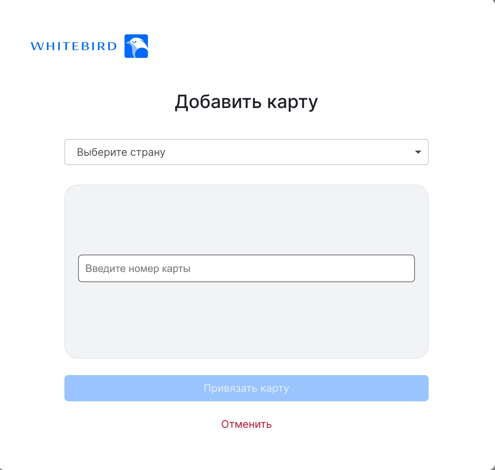

# MTS

### Available currencies:

* RUB

### Available Bank Card By Region:

* Russia

### Directions & Commission:

* Buy Crypto 2,5 %
* Sell Crypto 2 %

### Flow for binding card:

### First step

Verify that the payment provider is available

#### POST api/v2/exchange/merchant/payment/provider

**Headers**
- `x-api-key: {{x-api-key}}`

**Request**

```jsx
{
    "clientId": "3e1469fa-8d35-441c-87b1-a007aeba2562",
    "destination": "EXCHANGE"
}
```

**Response**

```jsx
{
    "id": "MTS",
    "name": "MTS",
    "addPaymentMethod": true,
    "config": {
        "paymentSystems": [
            {
                "paymentSystem": "MIR",
                "type": "PSP",
                "directions": [
                    {
                        "direction": "SELL",
                        "currencies": [
                            {
                                "currency": "RUB",
                                "countries": [
                                    "Russia"
                                ]
                            }
                        ]
                    }
                ]
            }
        ]
    }
}
```

It is sufficient to verify that the payment provider is available via the id field. id = MTS

**Headers**

<table width="100%">
  <thead><tr><th width="200" style="word-break: break-word; white-space: normal;">Name</th><th width="120">Type</th><th width="100">Required</th><th width="580">Description</th></tr></thead>
  <tbody><tr><td style="word-break: break-word; white-space: normal;">x-api-key</td><td>string</td><td>Yes</td><td>Authenticates the merchant server-to-server request. Use the API key issued for the merchant and target environment.</td></tr></tbody>
</table>

**Request**

<table width="100%">
  <thead><tr><th width="200" style="word-break: break-word; white-space: normal;">Name</th><th width="120">Type</th><th width="100">Required</th><th width="580">Description</th></tr></thead>
  <tbody>
    <tr><td style="word-break: break-word; white-space: normal;">clientId</td><td>string (UUID)</td><td>No</td><td>Client identifier used to scope the request to a specific client.</td></tr>
    <tr><td style="word-break: break-word; white-space: normal;">destination</td><td>string</td><td>No</td><td>Optional flow destination filter. Recommended value: EXCHANGE or SDK_EXCHANGE.</td></tr>
  </tbody>
</table>

**Response**

<table width="100%">
  <thead><tr><th width="240" style="word-break: break-word; white-space: normal;">Name</th><th width="120">Type</th><th width="640">Description</th></tr></thead>
  <tbody>
    <tr><td style="word-break: break-word; white-space: normal;">id</td><td>string</td><td>Provider identifier. For this flow expected value is MTS.</td></tr>
    <tr><td style="word-break: break-word; white-space: normal;">name</td><td>string</td><td>Provider display name.</td></tr>
    <tr><td style="word-break: break-word; white-space: normal;">addPaymentMethod</td><td>boolean</td><td>Defines whether provider supports adding payment methods.</td></tr>
    <tr><td style="word-break: break-word; white-space: normal;">config</td><td>object</td><td>Provider routing configuration.</td></tr>
    <tr><td style="word-break: break-word; white-space: normal;">config.paymentSystems</td><td>array of objects</td><td>Payment systems list for provider.</td></tr>
    <tr><td style="word-break: break-word; white-space: normal;">config.paymentSystems[].paymentSystem</td><td>string</td><td>Payment system name.</td></tr>
    <tr><td style="word-break: break-word; white-space: normal;">config.paymentSystems[].type</td><td>string</td><td>Provider channel type.</td></tr>
    <tr><td style="word-break: break-word; white-space: normal;">config.paymentSystems[].directions</td><td>array of objects</td><td>Supported operation directions for this payment system.</td></tr>
    <tr><td style="word-break: break-word; white-space: normal;">config.paymentSystems[].directions[].direction</td><td>string</td><td>Direction for payment system route (BUY/SELL).</td></tr>
    <tr><td style="word-break: break-word; white-space: normal;">config.paymentSystems[].directions[].currencies</td><td>array of objects</td><td>Supported currencies for selected direction.</td></tr>
    <tr><td style="word-break: break-word; white-space: normal;">config.paymentSystems[].directions[].currencies[].currency</td><td>string</td><td>Fiat currency for this route.</td></tr>
    <tr><td style="word-break: break-word; white-space: normal;">config.paymentSystems[].directions[].currencies[].countries</td><td>array of strings</td><td>Supported countries list for selected currency and direction.</td></tr>
    <tr><td style="word-break: break-word; white-space: normal;">commissions</td><td>array of objects</td><td>Provider commission settings returned for merchant route when available.</td></tr>
  </tbody>
</table>

### Second step

Generate link to bind client card

#### POST api/v2/exchange/merchant/payment/card/bind

**Headers**
- `x-api-key: {{x-api-key}}`

**Request**

`returnUrl` - optional link to the resource where the client should be redirected after binding the card.

```jsx
{
    "clientId": "3e1469fa-8d35-441c-87b1-a007aeba2562",
    "providerType": "MTS",
    "returnUrl": "https://www.google.com"
}
```

**Response**

```jsx
{
    "url": "https://frontnew.dev.wbdevel.net/attach-card?returnUrl=https%3A%2F%2Fwww.google.com&token=ODZjMmIxMmItYTMzMi00OWFkLWE0NDctZDAyYzBiNjIxZGM0fDE3NzQ5MDEzOTE5Nzh8MDZlYzdiOTU5ZGI5OTFkMjc2NWViMWNlN2JjMWE2NzVlNDZlZGJmNjUzMGRhYWZkNmE1MjdmNzMyMWYzZDk4Yw=="
}
```

**Headers**

<table width="100%">
  <thead><tr><th width="200" style="word-break: break-word; white-space: normal;">Name</th><th width="120">Type</th><th width="100">Required</th><th width="580">Description</th></tr></thead>
  <tbody><tr><td style="word-break: break-word; white-space: normal;">x-api-key</td><td>string</td><td>Yes</td><td>Authenticates the merchant server-to-server request. Use the API key issued for the merchant and target environment.</td></tr></tbody>
</table>

**Request**

<table width="100%">
  <thead><tr><th width="200" style="word-break: break-word; white-space: normal;">Name</th><th width="120">Type</th><th width="100">Required</th><th width="580">Description</th></tr></thead>
  <tbody>
    <tr><td style="word-break: break-word; white-space: normal;">clientId</td><td>string (UUID)</td><td>Yes</td><td>Client identifier used to bind payment method to a specific client.</td></tr>
    <tr><td style="word-break: break-word; white-space: normal;">providerType</td><td>string</td><td>Yes</td><td>Payment provider type. For this flow expected value is MTS.</td></tr>
    <tr><td style="word-break: break-word; white-space: normal;">returnUrl</td><td>string</td><td>No</td><td>Optional URL where client is redirected after card binding flow is finished.</td></tr>
  </tbody>
</table>

**Response**

<table width="100%">
  <thead><tr><th width="240" style="word-break: break-word; white-space: normal;">Name</th><th width="120">Type</th><th width="640">Description</th></tr></thead>
  <tbody><tr><td style="word-break: break-word; white-space: normal;">url</td><td>string</td><td>Provider URL that must be opened by client to complete card binding.</td></tr></tbody>
</table>

## Third step

Open link for the client to bind their card

Test card data: Choose country: Russia, Kazakhstan, Kyrgyzstan, Uzbekistan Number: 4469157300098872

```
                                                            Enter card details
```

<figure><figcaption></figcaption></figure>

\
\
How can I find out the result of a card binding?\
Use webhooks from Whitebird or use the request from step four

#### There are three webhooks from Whitebird:

#### client.payment.method.binding

Сlient initiated card binding

```
{
  "id": "webhook-id",
  "clientId": "ed8ff528-3017-45bc-9d4d-f90e58f91bf9",
  "bindId": "856c460d-7081-433b-904d-c46e313b1225",
  "providerType": "MTS",
  "createdAt": "2025-04-21T09:00:17+0000",
  "type": "client.payment.method.binding"
}
```

#### client.payment.method.bound

Сlient's card was successfully bound

```
{
  "id": "webhook-id",
  "clientId": "ed8ff528-3017-45bc-9d4d-f90e58f91bf9",
  "paymentToken": "7ee5900d-7a02-4bcf-a757-7a7b2fce462d",
  "providerType": "MTS",
  "createdAt": "2025-04-21T13:51:26+0000",
  "type": "client.payment.method.bound"

```

#### client.payment.method.failed

Сlient did not bind the card or the binding was declined by the bank

```
{
  "id": "webhook-id",
  "clientId": "5646c1b7-d934-44ce-8490-938feb810910",
  "bindId": "97d009fe-80e6-426d-8ea2-9784f676e08e",
  "cardMask": "0380",
  "brand": "MASTERCARD",
  "providerType": "MTS",
  "createdAt": "2025-04-22T07:47:31+0000",
  "type": "client.payment.method.failed"
}
```

If the client has successfully bound their card, you can get the card id in Whitebird as the paymentToken value

## Buy Crypto Flow:

### First step

Verify that the payment provider is available

#### POST api/v2/exchange/merchant/payment/provider

**Headers**
- `x-api-key: {{x-api-key}}`

**Request**

```jsx
{
    "clientId": "{{clientId}}",
    "destination": "SDK_EXCHANGE"
}
```

**Response**

```jsx
{
    "id": "MTS",
    "name": "MTS",
    "addPaymentMethod": true,
    "config": {
        "paymentSystems": [
            {
                "paymentSystem": "MIR",
                "type": "PSP",
                "directions": [
                    {
                        "direction": "SELL",
                        "currencies": [
                            {
                                "currency": "RUB",
                                "countries": [
                                    "Russia"
                                ]
                            }
                        ]
                    }
                ]
            }
        ]
    },
    "commissions": [
        {
            "buyCommission": "2,5",
            "sellCommission": "2,0"
        },
        {
            "destination": "EXCHANGE",
            "buyCommission": "2,5"
        },
        {
            "destination": "SDK_EXCHANGE",
            "buyCommission": "2,5",
            "sellCommission": "2,0"
        }
    ]
}
```

**Headers**

<table width="100%">
  <thead><tr><th width="200" style="word-break: break-word; white-space: normal;">Name</th><th width="120">Type</th><th width="100">Required</th><th width="580">Description</th></tr></thead>
  <tbody><tr><td style="word-break: break-word; white-space: normal;">x-api-key</td><td>string</td><td>Yes</td><td>Authenticates the merchant server-to-server request. Use the API key issued for the merchant and target environment.</td></tr></tbody>
</table>

**Request**

<table width="100%">
  <thead><tr><th width="200" style="word-break: break-word; white-space: normal;">Name</th><th width="120">Type</th><th width="100">Required</th><th width="580">Description</th></tr></thead>
  <tbody>
    <tr><td style="word-break: break-word; white-space: normal;">clientId</td><td>string (UUID)</td><td>No</td><td>Client identifier used to scope the request to a specific client.</td></tr>
    <tr><td style="word-break: break-word; white-space: normal;">destination</td><td>string</td><td>No</td><td>Optional flow destination filter. Recommended value: EXCHANGE or SDK_EXCHANGE.</td></tr>
  </tbody>
</table>

**Response**

<table width="100%">
  <thead><tr><th width="240" style="word-break: break-word; white-space: normal;">Name</th><th width="120">Type</th><th width="640">Description</th></tr></thead>
  <tbody>
    <tr><td style="word-break: break-word; white-space: normal;">id</td><td>string</td><td>Provider identifier. For this flow expected value is MTS.</td></tr>
    <tr><td style="word-break: break-word; white-space: normal;">name</td><td>string</td><td>Provider display name.</td></tr>
    <tr><td style="word-break: break-word; white-space: normal;">addPaymentMethod</td><td>boolean</td><td>Defines whether provider supports adding payment methods.</td></tr>
    <tr><td style="word-break: break-word; white-space: normal;">config</td><td>object</td><td>Provider routing configuration.</td></tr>
    <tr><td style="word-break: break-word; white-space: normal;">commissions</td><td>array of objects</td><td>Provider commission settings returned for merchant route when available.</td></tr>
  </tbody>
</table>

### Second step

#### POST api/v2/exchange/merchant/limit

**Headers**
- `x-api-key: {{x-api-key}}`

**Request**

```jsx
{
  "clientId": "{{clientId}}",
  "fromAsset": { "code": "RUB", "network": null },
  "toAsset": { "code": "TRX", "network": "Tron" },
  "paymentMethod": "MTS"
}
```

**Response**

```jsx
{
    "asset": {
        "id": "RUB",
        "code": "RUB"
    },
    "min": 921.05,
    "max": 368421.05
}
```

**Headers**

<table width="100%">
  <thead><tr><th width="200" style="word-break: break-word; white-space: normal;">Name</th><th width="120">Type</th><th width="100">Required</th><th width="580">Description</th></tr></thead>
  <tbody><tr><td style="word-break: break-word; white-space: normal;">x-api-key</td><td>string</td><td>Yes</td><td>Authenticates the merchant server-to-server request. Use the API key issued for the merchant and target environment.</td></tr></tbody>
</table>

**Request**

<table width="100%">
  <thead><tr><th width="200" style="word-break: break-word; white-space: normal;">Name</th><th width="120">Type</th><th width="100">Required</th><th width="580">Description</th></tr></thead>
  <tbody>
    <tr><td style="word-break: break-word; white-space: normal;">clientId</td><td>string (UUID)</td><td>No</td><td>Client identifier used to scope the request to a specific client.</td></tr>
    <tr><td style="word-break: break-word; white-space: normal;">fromAsset</td><td>object</td><td>Yes</td><td>Source asset object.</td></tr>
    <tr><td style="word-break: break-word; white-space: normal;">toAsset</td><td>object</td><td>Yes</td><td>Target asset object.</td></tr>
    <tr><td style="word-break: break-word; white-space: normal;">paymentMethod</td><td>string</td><td>Yes</td><td>Payment provider type used for the operation, for example MTS.</td></tr>
  </tbody>
</table>

**Response**

<table width="100%">
  <thead><tr><th width="240" style="word-break: break-word; white-space: normal;">Name</th><th width="120">Type</th><th width="640">Description</th></tr></thead>
  <tbody>
    <tr><td style="word-break: break-word; white-space: normal;">asset</td><td>object</td><td>Asset used for limit values.</td></tr>
    <tr><td style="word-break: break-word; white-space: normal;">asset.id</td><td>string</td><td>Internal asset identifier.</td></tr>
    <tr><td style="word-break: break-word; white-space: normal;">asset.code</td><td>string</td><td>Asset code.</td></tr>
    <tr><td style="word-break: break-word; white-space: normal;">min</td><td>number</td><td>Minimum allowed amount.</td></tr>
    <tr><td style="word-break: break-word; white-space: normal;">max</td><td>number</td><td>Maximum allowed amount.</td></tr>
  </tbody>
</table>

### Third step

#### POST api/v2/exchange/merchant/quote

**Headers**
- `x-api-key: {{x-api-key}}`

**Request**

```jsx
{
  "clientId": "{{clientId}}",
  "fromAsset": {
    "code": "RUB",
    "network": null,
    "amount": "922"
  },
  "toAsset": {
    "code": "TRX",
    "network": "Tron"
  },
  "paymentMethod": "MTS",
  "destinationCryptoAddress": "TCT2pKJXo233hrKWQMeCptC8My1KGvtsU4"
}
```

**Response**

```jsx
{
    "quoteId": "44008f44-3633-4ba3-b1a3-a90a85204b9f",
    "fromAsset": {
        "code": "RUB",
        "amount": "922"
    },
    "toAsset": {
        "code": "TRX",
        "network": "Tron",
        "amount": "31.495284"
    },
    "rate": 29.2742,
    "plainRate": 28.306,
    "fee": {
        "total": 23.05,
        "service": null,
        "network": 0.263,
        "asset": "RUB"
    },
    "expirationDate": "2026-05-04T09:24:15+0000"
}
```

**Headers**

<table width="100%">
  <thead><tr><th width="200" style="word-break: break-word; white-space: normal;">Name</th><th width="120">Type</th><th width="100">Required</th><th width="580">Description</th></tr></thead>
  <tbody><tr><td style="word-break: break-word; white-space: normal;">x-api-key</td><td>string</td><td>Yes</td><td>Authenticates the merchant server-to-server request. Use the API key issued for the merchant and target environment.</td></tr></tbody>
</table>

**Request**

<table width="100%">
  <thead><tr><th width="200" style="word-break: break-word; white-space: normal;">Name</th><th width="120">Type</th><th width="100">Required</th><th width="580">Description</th></tr></thead>
  <tbody>
    <tr><td style="word-break: break-word; white-space: normal;">clientId</td><td>string (UUID)</td><td>No</td><td>Client identifier used to scope the request to a specific client.</td></tr>
    <tr><td style="word-break: break-word; white-space: normal;">fromAsset</td><td>object</td><td>Yes</td><td>Source asset object (fromAsset/toAsset are required).</td></tr>
    <tr><td style="word-break: break-word; white-space: normal;">toAsset</td><td>object</td><td>Yes</td><td>Target asset object (fromAsset/toAsset are required).</td></tr>
    <tr><td style="word-break: break-word; white-space: normal;">paymentMethod</td><td>string</td><td>No</td><td>Optional provider type for quote route.</td></tr>
    <tr><td style="word-break: break-word; white-space: normal;">paymentMethodToken</td><td>string</td><td>No</td><td>Optional provider token/reference for selected route.</td></tr>
    <tr><td style="word-break: break-word; white-space: normal;">destinationCryptoAddress</td><td>string</td><td>No</td><td>Destination wallet address for crypto-out flows.</td></tr>
    <tr><td style="word-break: break-word; white-space: normal;">comment</td><td>string</td><td>No</td><td>Used only for the TON network as transfer memo. For other networks ignored.</td></tr>
  </tbody>
</table>

**Response**

<table width="100%">
  <thead><tr><th width="240" style="word-break: break-word; white-space: normal;">Name</th><th width="120">Type</th><th width="640">Description</th></tr></thead>
  <tbody>
    <tr><td style="word-break: break-word; white-space: normal;">quoteId</td><td>string</td><td>Quote identifier used for order creation.</td></tr>
    <tr><td style="word-break: break-word; white-space: normal;">fromAsset / toAsset</td><td>object</td><td>Resolved assets and amounts (code/network/amount).</td></tr>
    <tr><td style="word-break: break-word; white-space: normal;">rate / plainRate</td><td>number</td><td>Final rate and base reference rate.</td></tr>
    <tr><td style="word-break: break-word; white-space: normal;">fee.total</td><td>number</td><td>Total fee amount in fee.asset currency.</td></tr>
    <tr><td style="word-break: break-word; white-space: normal;">fee.service</td><td>number | null</td><td>Service fee component in fee.asset currency.</td></tr>
    <tr><td style="word-break: break-word; white-space: normal;">fee.network</td><td>number | null</td><td>Network/payment component in fee.asset currency.</td></tr>
    <tr><td style="word-break: break-word; white-space: normal;">fee.asset</td><td>string</td><td>Asset code in which fee.total, fee.service, and fee.network are expressed.</td></tr>
    <tr><td style="word-break: break-word; white-space: normal;">expirationDate</td><td>string</td><td>Quote expiration timestamp.</td></tr>
  </tbody>
</table>

### Fourth step

Create an order specifying `returnUrl` and `failUrl` (optional) after quote creation

#### GET api/v2/exchange/merchant/buy?quoteId=\{{quoteId\}}\&returnUrl=https://www.google.com\&failUrl=https://www.google.com

**Headers**
- `x-api-key: {{x-api-key}}`

**Request**

`quoteId`, `returnUrl`, and `failUrl` are sent as query parameters. `returnUrl` and `failUrl` are optional.

**Response**

```jsx
{
    "id": "966bc041-80a5-413a-abc7-0a45c13f9489",
    "type": "BUY",
    "status": "PROCESSING",
    "creationDate": "2026-05-04T09:25:15.257418",
    "modificationDate": "2026-05-04T09:25:17.952287"
}
```

**Headers**

<table width="100%">
  <thead><tr><th width="200" style="word-break: break-word; white-space: normal;">Name</th><th width="120">Type</th><th width="100">Required</th><th width="580">Description</th></tr></thead>
  <tbody><tr><td style="word-break: break-word; white-space: normal;">x-api-key</td><td>string</td><td>Yes</td><td>Authenticates the merchant server-to-server request. Use the API key issued for the merchant and target environment.</td></tr></tbody>
</table>

**Request**

<table width="100%">
  <thead><tr><th width="200" style="word-break: break-word; white-space: normal;">Name</th><th width="120">Type</th><th width="100">Required</th><th width="580">Description</th></tr></thead>
  <tbody>
    <tr><td style="word-break: break-word; white-space: normal;">quoteId</td><td>string (UUID)</td><td>Yes</td><td>Quote identifier.</td></tr>
    <tr><td style="word-break: break-word; white-space: normal;">destinationCryptoAddress</td><td>string</td><td>No</td><td>Destination wallet address for crypto-out flows.</td></tr>
    <tr><td style="word-break: break-word; white-space: normal;">comment</td><td>string</td><td>No</td><td>Used only for the TON network as transfer memo. For other networks ignored.</td></tr>
    <tr><td style="word-break: break-word; white-space: normal;">returnUrl</td><td>string</td><td>No</td><td>URL the client should be redirected to on successful payment flow.</td></tr>
    <tr><td style="word-break: break-word; white-space: normal;">failUrl</td><td>string</td><td>No</td><td>URL the client should be redirected to on failed payment flow.</td></tr>
  </tbody>
</table>

**Response**

<table width="100%">
  <thead><tr><th width="240" style="word-break: break-word; white-space: normal;">Name</th><th width="120">Type</th><th width="640">Description</th></tr></thead>
  <tbody>
    <tr><td style="word-break: break-word; white-space: normal;">id</td><td>string</td><td>Order identifier.</td></tr>
    <tr><td style="word-break: break-word; white-space: normal;">type</td><td>string</td><td>Order type (BUY).</td></tr>
    <tr><td style="word-break: break-word; white-space: normal;">status</td><td>string</td><td>Current order lifecycle state.</td></tr>
    <tr><td style="word-break: break-word; white-space: normal;">creationDate</td><td>string</td><td>Order creation timestamp in server date-time format.</td></tr>
    <tr><td style="word-break: break-word; white-space: normal;">modificationDate</td><td>string</td><td>Last order update timestamp in server date-time format.</td></tr>
    <tr><td style="word-break: break-word; white-space: normal;">cryptoTransaction</td><td>object | null</td><td>Crypto transaction summary object (hash only when present).</td></tr>
    <tr><td style="word-break: break-word; white-space: normal;">expiresAtDate</td><td>string | null</td><td>Order expiration timestamp.</td></tr>
  </tbody>
</table>

### Fifth step

Take `fiatTransaction.orderIdentity` from the order response.\
This value is the payment reference number that the user enters in the bank app to confirm the transfer.

#### GET https://api.dev.wbdevel.net/api/v2/exchange/merchant/order?orderId=\{{orderId\}}

**Headers**
- `x-api-key: {{x-api-key}}`

**Request**

`orderId` is sent as a query parameter.

**Response**

```jsx
{
    "id": "966bc041-80a5-413a-abc7-0a45c13f9489",
    "type": "BUY",
    "status": "PROCESSING",
    "creationDate": "2026-05-04T09:25:15.257418",
    "modificationDate": "2026-05-04T09:25:17.952287",
    "number": 151000004194,
    "exchangeOperation": {
        "inputCurrency": "RUB",
        "inputAsset": 922,
        "outputCurrency": "TRX",
        "outputAsset": 31.495284,
        "exchangeFeeAssetInFiat": 23.05,
        "bonusOutputAsset": null,
        "plainRatio": 28.306,
        "ratio": 29.2742,
        "currencyPair": {
            "fromCurrency": "RUB",
            "toCurrency": "TRX"
        }
    },
    "cryptoTransaction": {
        "hash": null,
        "externalCryptoAddress": "TCT2pKJXo233hrKWQMeCptC8My1KGvtsU4",
        "internalCryptoAddress": null,
        "fromAddress": null,
        "toAddress": "TCT2pKJXo233hrKWQMeCptC8My1KGvtsU4",
        "status": "NEW",
        "currency": "TRX",
        "fee": null,
        "feePaymentEnabledByClient": false,
        "type": "AUTO",
        "comment": null
    },
    "fiatTransaction": {
        "status": "PROCESSING",
        "paymentToken": null,
        "post": null,
        "brand": null,
        "internalToken": null,
        "orderIdentity": "5605652", // the number for confirming the transaction in the bank's application
        "link": null,
        "providerType": "MTS",
        "paymentType": null,
        "processingBank": null,
        "resultMessage": null,
        "currency": "RUB",
        "processorTransactionNumber": null
    },
    "client": {
        "clientId": "3e1469fa-8d35-441c-87b1-a007aeba2562"
    },
    "serverDate": "2026-05-04T09:25:36+0000",
    "exchangeType": "SELL",
    "operationType": "FIAT_TO_CRYPTO",
    "orderType": "DEFAULT",
    "completionDate": null,
    "resultMessage": null,
    "submitByResident": null,
    "merchantName": "wb",
    "merchantBonus": null,
    "promoCodeDetails": null,
    "fromSource": "EXT",
    "toSource": "EXT",
    "expiresAtDate": null
}
```

**Headers**

<table width="100%">
  <thead><tr><th width="200" style="word-break: break-word; white-space: normal;">Name</th><th width="120">Type</th><th width="100">Required</th><th width="580">Description</th></tr></thead>
  <tbody><tr><td style="word-break: break-word; white-space: normal;">x-api-key</td><td>string</td><td>Yes</td><td>Authenticates the merchant server-to-server request. Use the API key issued for the merchant and target environment.</td></tr></tbody>
</table>

**Request**

<table width="100%">
  <thead><tr><th width="200" style="word-break: break-word; white-space: normal;">Name</th><th width="120">Type</th><th width="100">Required</th><th width="580">Description</th></tr></thead>
  <tbody><tr><td style="word-break: break-word; white-space: normal;">orderId</td><td>string (UUID)</td><td>Yes</td><td>Order identifier returned by buy API.</td></tr></tbody>
</table>

**Response**

<table width="100%">
  <thead><tr><th width="240" style="word-break: break-word; white-space: normal;">Name</th><th width="120">Type</th><th width="640">Description</th></tr></thead>
  <tbody>
    <tr><td style="word-break: break-word; white-space: normal;">id</td><td>string</td><td>Order identifier.</td></tr>
    <tr><td style="word-break: break-word; white-space: normal;">type</td><td>string</td><td>Order type.</td></tr>
    <tr><td style="word-break: break-word; white-space: normal;">status</td><td>string</td><td>Current order lifecycle state.</td></tr>
    <tr><td style="word-break: break-word; white-space: normal;">exchangeOperation</td><td>object</td><td>Exchange side details (input/output, rates, fees).</td></tr>
    <tr><td style="word-break: break-word; white-space: normal;">cryptoTransaction</td><td>object</td><td>Crypto transfer details (addresses, hash, status, fee, type, comment).</td></tr>
    <tr><td style="word-break: break-word; white-space: normal;">fiatTransaction</td><td>object</td><td>Fiat processing details (provider, status, payment metadata).</td></tr>
    <tr><td style="word-break: break-word; white-space: normal;">fiatTransaction.orderIdentity</td><td>string | null</td><td>Payment reference number used by client in MTS Bank app for transfer confirmation.</td></tr>
    <tr><td style="word-break: break-word; white-space: normal;">creationDate</td><td>string</td><td>Order creation timestamp in server date-time format.</td></tr>
    <tr><td style="word-break: break-word; white-space: normal;">modificationDate</td><td>string</td><td>Last order update timestamp in server date-time format.</td></tr>
    <tr><td style="word-break: break-word; white-space: normal;">completionDate</td><td>string | null</td><td>Completion timestamp for finalized orders.</td></tr>
    <tr><td style="word-break: break-word; white-space: normal;">expiresAtDate</td><td>string | null</td><td>Order expiration timestamp.</td></tr>
  </tbody>
</table>

### Sixth step

#### **Payment confirmation step (MTS Bank)**

In production flow, after order creation the client must complete payment in the **MTS Bank mobile app**:

**“Transfers abroad” → “Belarus” → “RUB” → Enter amount → “WhiteBird” → Enter order number → Confirm transfer.**

<figure><figcaption></figcaption></figure>

### **Check order status**

#### GET /api/v2/exchange/merchant/order?orderId=\{{orderId\}}

**Headers**
- `x-api-key: {{x-api-key}}`

**Response**

```jsx
{
    "id": "966bc041-80a5-413a-abc7-0a45c13f9489",
    "type": "BUY",
    "status": "COMPLETED",
    "creationDate": "2026-05-04T09:25:15.257418",
    "modificationDate": "2026-05-04T09:28:06.042662",
    "number": 151000004194,
    "exchangeOperation": {
        "inputCurrency": "RUB",
        "inputAsset": 922,
        "outputCurrency": "TRX",
        "outputAsset": 31.495284,
        "exchangeFeeAssetInFiat": 23.05,
        "bonusOutputAsset": null,
        "plainRatio": 28.306,
        "ratio": 29.2742,
        "currencyPair": {
            "fromCurrency": "RUB",
            "toCurrency": "TRX"
        }
    },
    "cryptoTransaction": {
        "hash": "061b0a94d09330feeaa83fd88a2477227710cbbd9329f93d710719febba103cb",
        "externalCryptoAddress": "TCT2pKJXo233hrKWQMeCptC8My1KGvtsU4",
        "internalCryptoAddress": "TSaysSYUgBoKbtBgnXdxvNQPjkeXC1s9eM",
        "fromAddress": "TSaysSYUgBoKbtBgnXdxvNQPjkeXC1s9eM",
        "toAddress": "TCT2pKJXo233hrKWQMeCptC8My1KGvtsU4",
        "status": "CONFIRMED",
        "currency": "TRX",
        "fee": "0",
        "feePaymentEnabledByClient": false,
        "type": "AUTO",
        "comment": null
    },
    "fiatTransaction": {
        "status": "APPROVED",
        "paymentToken": null,
        "post": null,
        "brand": null,
        "internalToken": null,
        "orderIdentity": "5605652",
        "link": null,
        "providerType": "MTS",
        "paymentType": null,
        "processingBank": null,
        "resultMessage": null,
        "currency": "RUB",
        "processorTransactionNumber": null
    },
    "client": {
        "clientId": "3e1469fa-8d35-441c-87b1-a007aeba2562"
    },
    "serverDate": "2026-05-04T09:34:27+0000",
    "exchangeType": "SELL",
    "operationType": "FIAT_TO_CRYPTO",
    "orderType": "DEFAULT",
    "completionDate": "2026-05-04T09:28:04+0000",
    "resultMessage": null,
    "submitByResident": null,
    "merchantName": "wb",
    "merchantBonus": null,
    "promoCodeDetails": null,
    "fromSource": "EXT",
    "toSource": "EXT",
    "expiresAtDate": null
}
```
